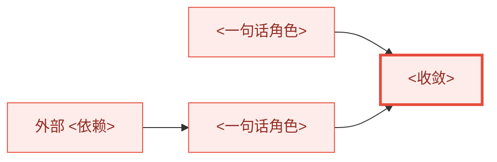

# <Arc 标题>

## 子任务（进度追踪）

| 状态 | 子任务 | spec | plan | PR |
|---|---|---|---|---|
| 🚧 未开始 | **<ID>** <一句话范围> | — | — | — |

<!-- 成稿移除提示。本文是这条 arc 唯一的 arc 级文档：设计与整体路线都写在这里，不另建 umbrella 级 plan。
每行是一个可独立合入的 PR 子任务。状态以子任务 plan 是否获批为准：获批前为 🚧 未开始，获批后为 ⏳ 进行中，
开 PR 后为 ✅ 已完成（contract 第 6 节）；spec/plan 列只要文档存在就填链接，与状态无关。 -->

说明面板的编号约定。

## 阶段依赖

说明入口、关键路径、可并行层、收敛点、默认推进顺序和每条硬依赖的原因。本图就是整体路线的 DAG，不在「整体路线」
中重画第二张。

## 问题与愿景

## 能力矩阵

## 设计原则

## 非目标

## 优先级与缓做项

## Arc 级验收

## 风险与取舍

## 整体路线

<!-- 成稿移除提示。本章是 arc 的主稿，只写路线级内容（contract 第 6.1 节）。子任务面板是路线的索引、阶段依赖图是
路线的 DAG，本章不重复子任务表或依赖图。文件级修改、测试命令、参数与阈值写在各子任务自己的 plan 中。 -->

### 路线总则

<全部子任务合入后哪些 Arc 级验收成立；代码基线；实施前提；外部依赖与已作裁决。>

### 跨 PR 的迁移路线

<切换需要多个 PR 时，列出中间状态序列：每个状态由哪个子任务进入、什么是权威、什么已生效、什么仍是缺口。
写明每次合入都必须保持的不变量。不需要迁移路线时说明原因。>

| 状态 | 进入它的子任务 | 权威 | 已生效 | 仍存在的缺口 |
|---|---|---|---|---|
| S0 当前 | — | <…> | <…> | <…> |

### 接口冻结点

| 接口 | 产出方 | 消费方 | 冻结时点 |
|---|---|---|---|
| <接口> | <子任务> | <子任务> | <产出方 spec 细化完成> |

### 路线级闸门与测试面

| 闸门 | 位置 | 必须证明 |
|---|---|---|
| <G1> | <子任务合入前后> | <证据> |

<测试面约定：相关性依据、生产形态、需要全量验证的子任务及理由（contract 第 8.1 节）。性能门槛在子任务 plan 中
于测量前冻结。>

### 推进方式、边界与回退

<逐个推进，每个子任务经过：细化 spec → plan → 批准 → execute → finish；接受本文不授权执行任何子任务。外部依赖的
处理方式；如实记录的中间态；必须回到设计讨论的变化；回退单位为整个子任务 PR。>

### 子任务文档约定

<命名与链接、骨架 spec 的建立时机、参数在子任务 plan 中测量前冻结、ADR 由哪个子任务写。>

### <ID>：<子任务名称>

#### 目标与前置输入

<对应本文的哪项行为；前置子任务或外部依赖；wave。spec/plan 链接只在面板中维护。>

#### 修改范围与关键工作

<模块或 crate 级范围，以及关键工作。文件级范围写在子任务 plan 中。>

#### 输出与交接

<合入后后继得到什么；冻结了哪个接口。>

#### 验证与完成条件

<验收要点与测试面，写到 crate、套件或场景这一级；是否需要全量验证及理由；这个子任务要写的 ADR。>

## 相关文档
