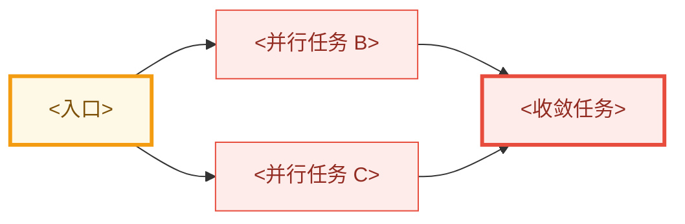

# 开发工作流契约

本文件是 `workbench` bundle **开发半区**的唯一流程源。所有开发阶段 skill 在行动前完整读取本文件；
不要依赖 bundle 外的流程文档。知识半区（场景 / 案例 / ADR）由同目录的 `ops-contract.md` 管辖。

## 目录

1. 文档根目录解析
2. 黄金规则
3. 阶段与人工门
4. 文档目录和类型
5. Frontmatter
6. Umbrella 面板、依赖图与整体路线
7. Plan 并行任务图
8. 测试面选择
9. Goal、sub-agent 与本地 commit
10. 归档
11. Git 与 PR
12. 完成检查

## 1. 文档根目录解析

按以下优先级解析 `DOC_ROOT`：

1. 使用用户在当前请求中明确给出的项目文档根。
2. 否则搜索 memory registry，选择与当前项目直接相关、最新、最具体且仍存在的文档根候选。
3. memory 没有可用候选时，使用 `<repo-root>/docs/workbench/`。

`DOC_ROOT` 是**项目文档根**，其下并列两个半区：`workflow/` 承载本契约管辖的开发产物
（spec / plan / umbrella / archive），`ops/` 承载工程知识库（由 `ops-contract.md` 管辖）。
**不要把 `DOC_ROOT` 解析到其中任一子目录**——若 memory 记录的候选直接指向 `.../workflow`，
取其父目录作为 `DOC_ROOT`。

读取 `DOC_ROOT` 和目标子目录下适用的 `AGENTS.md`。具体子目录规则优先于本契约的默认布局。Memory 只用于定位，
不得替代实时文件和当前代码证据。不要把解析出的机器相关绝对路径写回 skill、模板或代码仓库。

默认最小目录布局：

```text
DOC_ROOT/
  workflow/
    specs/
    plans/
    archive/
      specs/
      plans/
  ops/          # 工程知识库，见 ops-contract.md；本契约不管辖
```

多阶段 arc 或 roadmap 需要时，可增加：

```text
DOC_ROOT/
  workflow/
    Roadmap.md
    Umbrella.base
    Specs.base
    umbrella/
    archive/
      umbrella/
```

`Roadmap.md`、`.base`、umbrella、wikilink 和对应元数据是可选能力，只在当前请求、现有文档体系或适用
`AGENTS.md` 要求时启用。若 `DOC_ROOT` 已有等价布局，沿用现状，不复制第二套目录。

## 2. 黄金规则

1. 所有设计、spec、plan、umbrella 和 roadmap 文档写入 `DOC_ROOT/workflow/` 下对应子目录。
   知识条目（场景 / 案例 / ADR）不写在这里，见 `ops-contract.md`。
2. 用户沟通、设计文档、代码、注释、日志、错误、commit message 和 PR 文本的语言遵循当前请求和适用的
   `AGENTS.md`；没有项目规则时，用户沟通与文档跟随用户语言，代码侧产物保持项目现有约定。
3. 写 spec 前逐条核实代码事实并记录 `file:line`；区分事实、怀疑和提案。
4. 使用适用 `AGENTS.md` 定义的真实生产形态作为行为和验收基准；测试便利形态不能替代生产形态验证，也不应驱动
   特殊架构分支。
5. 永久 guard 只保护长期行为契约。迁移编号、旧符号不存在、精确 owner/file/token/count 等源码形状检查不得作为
   完成态永久 guard；临时迁移检查必须在完成迁移的同一 PR 删除。
6. 设计变更必须回到讨论阶段；不要在 plan 或实现中静默改写 accepted spec。
7. 历史归档是长期知识库。写新 spec/plan 前搜索 active 与 archive，避免重复立项或把已完成能力误判成缺口。
8. 验证按改动的影响面选择：定向验证是默认形态，全量验证是需要写明理由的少数点，见第 8 节。

## 3. 阶段与人工门

标准流程：

```text
讨论清楚问题
  -> accepted design
  -> spec / umbrella
  -> plan 阶段直接落盘并迭代 draft
  -> 用户明确批准落盘版本
  -> goal 驱动的本地实现与验证
  -> 用户另行明确授权
  -> push / PR / archive
```

阶段路由：

| 阶段 | Skill | 终态 |
|---|---|---|
| 理解（只读旁路） | `$dev-workflow-explain-technical-concept` | 技术概念、当前机制、证据边界和权衡已讲清 |
| 讨论 | `$dev-workflow-discuss-design` | 问题、证据、目标、非目标和关键裁决被接受 |
| Spec | `$dev-workflow-write-spec` | 一个 PR spec，或含整体路线的 umbrella 已落盘 |
| Plan | `$dev-workflow-plan` | plan 已落盘，用户明确批准且状态为 `approved` |
| Execute | `$dev-workflow-execute` | 本地实现完成且验证通过 |
| Finish | `$dev-workflow-finish` | 明确授权的发布与归档完成 |

只设置两个常规人工门：

1. **设计接受门**：用户明确接受问题定义、目标、非目标和关键设计决策。
2. **计划批准门**：用户明确批准已经落盘的最终实现计划。

**Umbrella arc 只有一份 arc 级文档。** 会派生多个子任务的 arc 由 umbrella 统一承载：它既写 arc 的设计，也写
整体路线，是这条 arc 的主稿（第 6.1 节）。不在 `plans/` 另建 umbrella 级 plan。推进顺序：
1. 讨论并接受 arc 设计后，把设计与整体路线写入 umbrella，由用户明确接受；
2. 子任务**逐个推进**，每个子任务各自经过：细化 spec → 编写子任务 plan → 计划批准门 → execute → finish。

接受 umbrella 只确认设计与路线，即子任务切分、依赖、接口冻结点与闸门，不构成任何子任务的执行授权。子任务的执行
授权来自它自己获批的 plan。

技术讲解不是状态机中的交付阶段，可以从任意阶段进入。它保持只读，不表示设计已接受、plan 已批准或实现已获授权；讲解
完成后返回进入前的阶段。若用户随后要求产出 spec、plan 或代码，再路由到对应 skill 并执行其阶段门。

端到端请求可以在阶段完成后自动继续。plan 阶段必须在当前可编辑模式中直接写入并迭代文档，不得要求用户切换 Codex
Plan mode，也不得把仅存在于对话中的计划当成阶段产物。Execute 结束后不得自动发布；push 和 PR 始终需要独立的明确
授权。

## 4. 文档目录和类型

本节及第 10 节出现的 `specs/`、`plans/`、`umbrella/`、`archive/` 均相对 `DOC_ROOT/workflow/`。

- 会派生多个独立 spec 的多阶段 arc：项目启用 umbrella 时写入 `umbrella/`，`type: design-umbrella`；否则按项目
  约定记录父子关系。Umbrella 同时承载整体路线（第 6.1 节），没有对应的 umbrella 级 plan。
- 可独立实现、一个 PR 粒度的执行单元：写入 `specs/`，`type: design-spec`；项目启用 roadmap 时再添加对应字段。
- 实现计划：写入 `plans/`，`type: implementation-plan`；编写和评审期间为 `status: draft`，用户明确批准当前落盘版本后
  改为 `status: approved`。
- Umbrella 拆出的每个子任务，都是一个**可独立合入的 PR**，维护自己的 spec 与 plan：
  - 写 umbrella 的整体路线时，可以为即将开工的子任务先建骨架 spec（`design_status: skeleton`）；
  - 其余子任务在前置接近完成时再建；
  - 子任务实现前，先细化 spec，再单独编写 plan。
- 已开 PR 的完成态文档：移动到 `archive/` 下同名类型目录。

文件命名：

- spec / umbrella：`YYYY-MM-DD-<kebab-slug>-design.md`
- plan：`YYYY-MM-DD-<kebab-slug>-plan.md`

项目启用 umbrella 时，从属某 arc 的 spec 在 frontmatter 添加 `umbrella: "[[<umbrella-basename>]]"`，并在
umbrella 子任务面板建立反向入口。

### 4.1 面向评审的文档组织

单 PR Spec 使用 write-spec skill 及模板规定的九章结构，Plan 使用 plan skill 及模板规定的六章结构。Spec 先解释
任务、问题、目标，在概念章单列名词解释，再由独立的“设计裁决”章明确关键选择，随后展开机制与取舍；Plan 用关键结构、
流程和具名阶段落实实现。名词解释覆盖 spec/plan 的术语与重要代码对象，并区分现有类型与示意结构。Umbrella 保留第 6 节及其独立模板。

一级章节及顺序默认保留，章内组织可随任务调整；确实不适用时简短说明原因，不编造内容。用户或项目另有明确结构
要求时遵循该要求。合并重复内容时保留设计依据、实施阶段和验收条件；review 意见整合进对应章节。
一次修订以用户指定的文档为范围；用户限制为一个 spec/plan 时，不批量
改写其他文档。发现范围外冲突可以报告，不把它自动扩成修改授权。

## 5. Frontmatter

> **tags 前缀沿用项目既有约定，不因 bundle 更名而改**。下方模板中的 `dev-workflow/*` 是默认值；
> 项目已在用别的前缀（如 `<project>/design`）时以项目为准。现有 spec / plan / umbrella 与
> `Specs.base` / `Umbrella.base` 的聚合都依赖当前前缀，改名会断掉 Roadmap 索引——不要「顺手」统一。

Spec 的最小 frontmatter 使用：

```yaml
---
title: "<ID>：<一句话标题>"
date: YYYY-MM-DD
type: design-spec
status: active
---
```

项目启用 roadmap 时，再增加：

```yaml
roadmap: true
module: <module>
module_label: "<模块显示名>"
priority: TBD
priority_order: 999
roadmap_status: todo
roadmap_status_label: "未开始"
roadmap_source: spec-frontmatter
# legacy_roadmap_items: <旧编号>
# umbrella: "[[<umbrella-basename>]]"
tags:
  - dev-workflow/design
  - dev-workflow/specs
  - dev-workflow/roadmap
```

项目启用 umbrella 时，umbrella 使用相同 Roadmap 字段，但 `type: design-umbrella`，且不写 `umbrella:`。

Plan 使用：

```yaml
---
title: "<Spec 标题>实现计划"
date: YYYY-MM-DD
type: implementation-plan
status: draft
spec: "[[<spec-basename>]]"
tags:
  - dev-workflow/design
  - dev-workflow/plans
---
```

骨架 spec 标 `design_status: skeleton`，细化完成后改为 `accepted`。子任务 spec 的 `roadmap_status` 跟随第 6 节的
面板状态：未开始为 `todo`，进行中为 `active`，已完成为 `done`。

Plan 正文必须链接 spec；spec 必须按项目约定反链 plan，没有既有约定时在第 9 章“未决问题与后续衔接”放置 plan wikilink。
plan 阶段开始后直接创建并维护这份文档。只有用户明确批准与磁盘内容一致的版本后，才把 `status` 更新为
`approved`；未批准草案不得进入 Execute。影响 DAG、文件所有权、验收边界、关键依赖或风险裁决的修订会使批准失效，
必须先退回 `draft` 并重新批准。

项目启用 Roadmap 时，只更新文档 frontmatter、umbrella 子任务面板和阶段依赖图。`Roadmap.md` 由 Bases 聚合时，
不手改其聚合行。

## 6. Umbrella 面板、依赖图与整体路线

本节仅适用于启用了 umbrella 的项目。Umbrella 正文开头依次放置：

1. `## 子任务（进度追踪）`
2. `## 阶段依赖`

设计章节之后放置 `## 整体路线`（第 6.1 节）。

子任务面板固定列：

```markdown
| 状态 | 子任务 | spec | plan | PR |
|---|---|---|---|---|
| ✅ 已完成 | **<ID>** <一句话范围> | [[<spec>]] | [[<plan>]] | [#N](<url>) |
| ⏳ 进行中 | **<ID>** <一句话范围> | [[<spec>]] | [[<plan>]] | — |
| 🚧 未开始 | **<ID>** <一句话范围> | [[<spec>]] | [[<plan>]] | — |
| 🚧 未开始 | **<ID>** <一句话范围> | — | — | — |
```

状态只看两件事：**子任务 plan 是否已获批**，以及**是否已开 PR**。spec 或 plan 草稿是否存在，不影响状态。

- `🚧 未开始`：子任务 plan 尚未获批。这包括尚无文档、只有骨架 spec、spec 已细化但 plan 仍为 `draft` 等情形。
- `⏳ 进行中`：子任务 plan 已获批（`status: approved`），但尚未开 PR。
- `✅ 已完成`：已开 PR。被其他任务吸收或明确作废时也可以标 ✅，但必须说明原因。
- 子任务按其 plan 拆成多个 PR 时，只要还有 PR 未开，整体保持 `⏳ 进行中`。

状态由对应事件驱动更新：
- 子任务 plan 获批时，由 plan 阶段置为 `⏳ 进行中`；
- PR 创建后，由 finish 阶段置为 `✅ 已完成`；
- 接受 umbrella（含整体路线）、写 spec、起草 plan，都不改变子任务状态；
- 已获批的 plan 退回 `draft` 时，状态回到 `🚧 未开始`。

Spec、plan 和 PR 分列独立维护，各列只要文档存在就填入链接，与状态无关。归档后保留 spec/plan wikilink，只更新状态和 PR。

阶段依赖图使用 `flowchart LR`，只画硬依赖。节点填充色表示状态，关键入口和收敛点用粗描边：



图后说明入口（可以有多个独立入口）、关键路径、可并行层、收敛点、默认推进顺序及每条硬依赖的原因。

面板状态、节点颜色、子任务 spec 的 `roadmap_status` 和 umbrella 的 `roadmap_status` 必须同步。节点颜色：`✅ 已完成` 用 `done`，`⏳ 进行中` 用 `active`，`🚧 未开始` 用 `todo`。umbrella 的状态按面板汇总：

- 全部 🚧：`todo`
- 出现 ⏳ 或 ✅，但未全部 ✅：`active`
- 全部 ✅：`done`，随后归档 umbrella

### 6.1 整体路线（主稿）

Umbrella 就是 arc 的主稿。`## 整体路线` 一章只负责路线，不写子任务的实现细节。路线的单位是**子任务**，每个子任务
是一个可独立合入的 PR：行为完整，合入后主线保持自洽，不依赖后续 PR 才能正确。子任务面板就是路线的索引，阶段依赖图
就是路线的 DAG；整体路线一章不再重复一份子任务表或第二张依赖图。

整体路线包含：

1. **路线总则**：全部子任务合入后哪些 arc 级验收成立、代码基线、实施前提、外部依赖与已作裁决。
2. **推进顺序**：默认逐个推进，同一时间只有一个子任务处在 plan/execute 中；是否并行由用户决定。默认顺序写在
   依赖图之后，外部依赖作为图中的节点单列。
3. **接口冻结点**：跨子任务的接口由谁产出、谁消费、在产出方 spec 的哪个时点冻结；消费方 plan 在冻结之后才能编写。
4. **跨 PR 的迁移路线**：切换需要多个 PR 才能完成时（例如新旧机制交替），给出中间状态序列，以及每次合入都必须
   保持的不变量，并如实写明每个中间态仍然存在的缺口。
5. **路线级闸门**：进入后续子任务前必须取得的证据，以及需要全量验证的子任务及其理由（第 8.1 节）。
6. **边界与风险**：外部依赖的处理方式、必须回到设计讨论的变化，以及回退单位（整个子任务 PR）。

每个子任务在整体路线中保留一节，沿用 plan 的四个小节，但只写路线级内容：
- 目标与前置；
- 模块或 crate 级的修改范围；
- 交接给谁、交接什么；
- 验收要点与测试面（写到 crate、套件或场景这一级）。

整体路线**不写**文件级修改、测试命令、参数与阈值，这些属于子任务 plan。

子任务文档按以下顺序推进：
1. 写整体路线时，可以为即将开工的子任务先建骨架 spec（`design_status: skeleton`），固定范围、契约与验收；其余
   子任务在前置接近完成时再建。
2. 子任务实现前，先按 `$dev-workflow-write-spec` 细化 spec；细化只做工程层面的局部选择，改变方向时回到设计讨论。
3. 再为该子任务写独立 plan（第 7 节）。
4. 用户批准该 plan 后才进入执行，面板状态随之变为 `⏳ 进行中`（第 6 节）。

整体路线写入或修订后，需要用户明确接受。子任务切分、依赖、接口冻结点、迁移路线或闸门的变化都属于 umbrella 修订；
改变方向、外部契约、所有权或失败语义的，先回到 `$dev-workflow-discuss-design`。子任务内部细节的变化只修订子任务
自己的文档。

## 7. Plan 并行任务图

plan 阶段在当前可编辑模式中研究代码并把结果直接写入 plan 文档。尽量把实现计划设计成可由多个 sub-agent 安全并行
调度的 task graph，但不得为了并行而制造错误边界。本节适用于单 PR plan，包括 umbrella 子任务的 plan；umbrella
本身不写 plan，它的整体路线见第 6.1 节。

计划必须包含：

1. **任务 DAG**：稳定 task ID、硬依赖、关键路径、并行 waves 和最终收敛点。
2. **文件所有权**：每个 task 的精确文件 / 模块范围；并行 task 默认不得写同一文件。
3. **输入与输出契约**：前驱提供什么，后继依赖什么。
4. **独立验证**：每个 task 可单独运行的测试、探针或静态检查。按第 8 节写明这个 task 的改动影响哪些具体
   测试目标 / 套件 / 用例；不接受「跑测试」「跑套件」这类不指向具体目标的写法。
5. **集成验证**：每个 wave 收敛后的组合验证和与项目风险相称的最终生产形态验证。全量验证属于这里和最终验证，
   不属于每个 task。
6. **调度标签**：
   - `sub-agent-safe`：依赖满足、范围独立、可并行；
   - `main-agent`：跨任务整合、共享文件、高风险语义或最终收敛；
   - `serial`：必须按顺序执行。
7. **风险与回退**：高风险切换点、恢复策略和必须回到设计讨论的变化。
8. **Commit 检查点**：完整切片结束后或进入高风险改动前的本地 commit 边界。

优先切分行为完整、可验证、文件范围互不重叠的任务。以下情况保持串行：

- 多个任务必须同时修改同一核心文件或同一共享 schema；
- 后一任务的正确接口取决于前一任务的实现结果；
- 跨模块语义只能整体裁决；
- 并行会造成重复迁移、冲突 owner 或不可独立验证的半状态。

每个 task 必须有独立可定位的具名阶段说明，并按 plan 模板保留目标/输入、范围/工作、输出/交接、验证/完成四个小节；
DAG 节点使用“编号 + 名称”。关键结构与流程伪代码关联负责阶段，前驱输出明确对应后继输入。
完整阶段说明是执行依据，不能只保留编号链或调度表。

任务较多或并行关系需要索引时，可增加紧凑调度表；完整文件范围、验证和交接写在阶段正文，避免双份维护。例如：

```markdown
| 阶段 | 前置 | Wave / Label | 交付摘要 |
|---|---|---|---|
| T1：<行为切片> | — | 1 / sub-agent-safe | <contract> |
| T2：<行为切片> | — | 1 / sub-agent-safe | <contract> |
| T3：<集成收敛> | T1、T2 | 2 / main-agent | <integration> |
```

各阶段写具体可运行的定向验证目标。某个 task 确实需要全量验证时，在阶段说明中写明属于第 8.1 节的哪一条理由。

## 8. 测试面选择

测试按改动的影响面选择，不按「跑得越多越安全」选择。本节同时约束 plan 的验证列和 execute 的执行循环。

### 8.1 判据

每个验证动作都要能回答三问：这次改动可能改变哪些行为，哪些测试会因此失败，其余测试为什么不会。答不出第三问，
说明改动面还没界定清楚——先界定，再跑。

**定向验证是默认形态**：只运行覆盖被改行为的测试目标、套件或用例。

**全量验证只在以下明确的点运行**：

1. wave / 里程碑收敛；
2. 声称实现完成前的最终验证；
3. 改动触及共享类型词汇表、wire 或持久化格式、跨模块公共契约、全局构建配置——这类改动的影响面本来就是全仓库；
4. 改动面无法界定：定向验证出现无法解释的失败，或改动落在没有明确 owner 的边界上。

第 3、4 条是理由，不是默认。plan 中要求全量的任务必须写明属于哪一条；execute 中临时升级到全量时，先记录触发
条件再跑。

### 8.2 代价与负载敏感失败

全量验证不是免费的保险：

- 它按仓库规模而不是改动规模收费，单轮耗时通常比定向验证高一到两个数量级；
- 依赖外部进程、容器或端口的测试（服务器、集群、对象存储）还要为每一轮付出生命周期成本；
- 机器满载会引入**负载敏感的假失败**：依赖时间常量、超时或进程就绪的用例在并发压力下失败，与被改代码无关。

因此全量结果不能直接当成归因结论：

1. 先看第一个失败，不看失败数量。一个早期失败可能让其后的用例集体成为级联受害者，失败数虚高不等于问题面大。
2. 判定单个失败是否由本次改动引起，判据是**单独重跑该用例**。单跑即过、且失败落在时间敏感用例上的，按负载噪声
   处理并记录，不据此回滚改动。
3. 适用 `AGENTS.md` 已点名的负载敏感用例和已知失败基线按其记载处理，不重新归因。
4. 全量结果与定向结果冲突时，以针对被改行为的定向复跑为准。

### 8.3 相关性依据

「哪些测试相关」必须有可查依据：适用 `AGENTS.md`、测试目录自身的说明文档、测试与被改模块的实际依赖关系。
不靠记忆，也不靠「名字看起来相关」。

依据不足以判断相关性时，优先补齐依据本身——给测试目录补一份覆盖面映射，或把判据写进适用 `AGENTS.md`——
而不是用一次全量掩盖判断缺失。plan 阶段发现依据缺失的，把补齐依据列为计划中的一个任务。

## 9. Goal、Sub-agent 与本地 Commit

Execute 开始时必须创建或继续当前 goal。Goal 明确绑定 spec、approved plan、本地行为结果和验证终态；不得包含 push
或 PR。

持续执行规则：

- 普通编译失败、测试失败、遗漏调用点、耗时超预期和可逆局部重构都由 agent 自主处理。
- 只有需要改变 accepted spec 的目标、外部协议、持久化格式、所有权边界或失败语义，或者缺少用户专属权限 /
  业务裁决、需要未授权破坏性或生产操作时，才暂停询问。
- 只有目标实际完成才标记 `complete`。
- 只有同一阻塞连续至少三个 goal turn 且安全替代路径耗尽后才标记 `blocked`。

Sub-agent 调度：

1. 默认优先调度：存在两个或以上依赖已满足、标记 `sub-agent-safe`、文件范围不冲突且能产生独立证据的 task 时，使用可用
   sub-agent 并行处理；不得仅因协调成本而全部串行化。
2. 仅当串行明显更有优势时才不调度：改动极小、共享高风险语义或同一文件、需要连续交互式调试、并发会拖慢关键构建/测试，或
   主 agent 已在不可安全切分的同一整合范围中工作。例外必须在 plan 或 commentary 中简短说明。
3. 给每个 sub-agent 传递 accepted spec、对应 plan task、精确写入范围、禁止项和验证命令。
4. 主 agent 保留 goal、任务图、共享文件、集成和最终验证所有权。
5. 主 agent 对照代码复核 sub-agent 结论，不直接信任摘要。
6. 共享工作树中的 sub-agent 无论串行或并行都不得 commit；由主 agent 在 wave 集成和验证后创建检查点 commit。
7. 只有显式使用独立 worktree 或独立 clone、并配有任务专用 branch 时，sub-agent 才可各自本地 commit；仍禁止
   push 和 PR，由主 agent 集成。
8. 高风险共享语义、最终收敛和跨 task 冲突由主 agent 串行处理。

本地 commit：

- 只在任务本地开发分支创建，不在 detached HEAD、主分支或无关分支创建。
- 完整章节 / 行为切片完成并通过定向验证后，可以创建检查点 commit。
- 进入高风险、跨模块或难回滚改动前，可以为当前稳定状态创建恢复点。
- 只暂存本任务文件，使用当前请求和适用 `AGENTS.md` 规定的 commit message 语言，并在 plan 执行记录中关联
  task / wave。
- Commit 不表示 plan 或 goal 完成。
- Execute 阶段始终禁止 push 和 PR。

## 10. 归档

`archive/` 是完成态知识库，不是删除区。它保存设计、计划、验收、取舍、失败路径和 PR 入口。

PR 创建成功后：

1. 搜索待归档 spec / plan 的全部 wikilink。
2. 将 spec 移到 `archive/specs/`，plan 移到 `archive/plans/`。
3. 项目启用 umbrella 时，保留其面板中的 spec / plan wikilink。
4. 项目启用 roadmap / umbrella 时，把子任务标为 `✅ 已完成`，填写 PR 链接，并同步依赖图节点颜色与子任务 spec 的
   `roadmap_status`。子任务按其 plan 拆成多个 PR 时，最后一个 PR 创建后才标 ✅，并归档其 spec/plan。
5. 项目启用 umbrella 且整条 arc 全部完成后，将 umbrella 移到 `archive/umbrella/`。

若一组互相引用的文件一起归档，确认 archive 外没有意外断链。归档文档不继续维护 active 状态；后续工作新建 active
spec/plan，并链接历史归档。

## 11. Git 与 PR

- Push 只能发往用户或适用 `AGENTS.md` 明确授权的 remote；不得把 remote 名称、目标仓库、base 或 head 写死在 skill 中。
- 未明确授权可写 remote 时，不得假定 `origin`、`upstream` 或任何 fork 可写。
- PR 默认创建为 ready for review；目标仓库、base、head 和模板从项目配置、remote、适用 `AGENTS.md` 或用户指令解析。
  关键目标仍不明确时先询问用户。
- Commit、PR 标题和正文的语言及 trailer 规则遵循当前请求和适用 `AGENTS.md`。
- 两个独立 bug / feature 拆为独立 PR；从合适基线建立干净分支。
- 能力缺失应在真正拥有该能力的组件修复，不在错误层级添加 guard / flag 绕过。
- 不在缺少用户需求或兼容证据时引入兼容层、迁移双格式或 shim。
- Push、PR、归档仅由 `$dev-workflow-finish` 在用户明确授权后执行。

## 12. 完成检查

声称阶段完成前：

- Explanation：前置概念、贯穿示例、因果机制、证据边界、分层判断和现实权衡完整；未产生未经授权的修改。
- Discussion：事实、怀疑、提案分离；重大决策已接受。
- Spec：开头解释任务、问题和目标，机制、取舍与验收形成因果链；代码证据当前有效；frontmatter 可解析；启用
  Roadmap / umbrella 时，元数据、反链和依赖图一致。
- Umbrella：设计与整体路线在同一份文档中，没有另建 umbrella 级 plan；整体路线只含路线级内容，不重复面板或依赖图；
  每个子任务都是可独立合入的 PR，各有一节、四个小节，spec/plan 链接在面板中维护；接口冻结点、跨 PR 的迁移路线与
  闸门已写明；用户已明确接受；接受 umbrella 不改变任何子任务的状态。
- Plan：文档已落盘；用户明确批准当前磁盘版本；状态为 `approved`；DAG、并行 waves、文件所有权、验证和 commit
  边界完整；所有 task ID 均有具名阶段说明，关键结构与流程有阶段归属；每个任务的验证指向具体测试面，要求全量验证的任务写明理由。
  获批的是子任务 plan 时，umbrella 面板已置为 `⏳ 进行中`，依赖图与 spec 的 `roadmap_status` 已同步。
- Execute：plan 必需 task 全部完成；定向、集成和生产形态验证与风险相称；全量验证只在第 8.1 节允许的点运行；
  失败已按单跑判据区分真实失败与负载噪声；无临时文件和残留进程。
- Finish：发布授权明确；PR 已创建；spec/plan 已归档；启用 umbrella / Roadmap 时，对应状态已更新。
