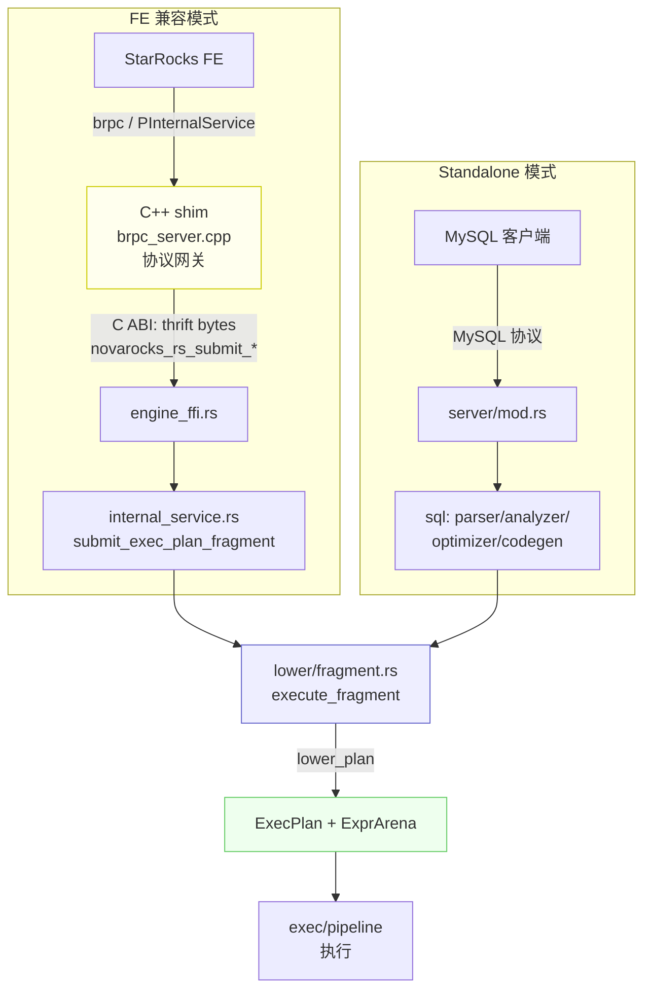

# 第 0 篇《总览 + 从计划到可执行计划》写作计划

> **For agentic workers:** REQUIRED SUB-SKILL: Use superpowers:subagent-driven-development (recommended) or superpowers:executing-plans to implement this plan task-by-task. Steps use checkbox (`- [ ]`) syntax for tracking.

**Goal:** 写出 NovaRocks 技术分析系列的第 0 篇——一篇面向懂行工程师、可直接发布的中文文章，讲清"NovaRocks 是什么 / 为什么用 Rust 重写 StarRocks BE / 双模式如何共享一套执行内核 / C++ shim 只做协议网关 / fail-fast"，并以 Plan Lowering（thrift 计划 → `ExecPlan`+`ExprArena`）作为"从计划到可执行"的落点。

**Architecture（本次工作的组织方式）：** 源码调研已完成（两个 Explore agent 带回 `file:line` 级素材，见本计划内嵌的"取材清单"）。本计划把素材转成逐节草稿：先核对要引用的真实代码片段、产出一张架构图，再按"钩子 → 总览 → 设计与实现（双模式入口 / FFI 边界 / Plan Lowering）→ 取舍与对照 → 小结"五段式成稿，最后做准确性自查并提交。产出文件：`docs/articles/zh/00-overview-and-lowering.md`。

**Tech Stack:** Markdown + mermaid 架构图；源码取材锚定 `src/main.rs`、`src/service/{internal_service,compat,backend_service,heartbeat_service}.rs`、`src/shim/{compat.h,brpc_server.cpp,compat.cpp}`、`src/lower/{fragment,node/mod,expr/mod,layout,type_lowering}.rs`、`src/exec/{node/mod,expr/mod}.rs`。

---

## 文件结构

- **创建**：`docs/articles/zh/00-overview-and-lowering.md`（文章成稿）
- **只读核对（不修改）**：上面 Tech Stack 列出的全部源码文件
- **本计划**：`docs/design/plans/2026-06-09-article-00-overview-and-lowering.md`

文章目标长度 3000-4500 字，配 1 张架构图，代码片段精选 6-8 段（每段 5-20 行），每段必须标注 `path:line` 并在 Task 1 中核对为真实内容。

---

## 取材清单（来自源码调研，Task 1 负责逐条核对）

> ⚠️ 以下行号来自 Explore 调研，可能有偏移。Task 1 必须打开文件核对真实行号与逐字内容；正文只引用核对过的片段。

**双模式入口**
- `src/main.rs:≈544-571`：进程入口按 `mode` 分派——默认 `run`（FE 兼容后端），`standalone-server` 走独立路径。
- `src/main.rs:≈292-319`：`run_standalone_server_cli()` 按 role（fe/be/all-in-one）分派。

**C++/Rust FFI 边界**
- `src/shim/compat.h:≈42-91`：C ABI——`NovaRocksRustBuf{ptr,len}`、`NovaRocksUniqueId{hi,lo}`，查询四函数 `novarocks_rs_submit_exec_plan_fragment` / `novarocks_rs_submit_exec_batch_plan_fragments` / `novarocks_rs_fetch_result_batch` / `novarocks_rs_cancel`（注释明确 attachment 为 Thrift BINARY）。
- `src/shim/brpc_server.cpp:≈1161-1170`：`exec_plan_fragment` 取出 attachment 字节后**直接转发** `novarocks_rs_submit_exec_plan_fragment(ptr,len)`，C++ 侧只回填 status，无执行逻辑。
- `src/service/internal_service.rs:≈1368-1606`：`submit_exec_plan_fragment(thrift_bytes)` 反序列化 → 组装 query context → 调用 `execute_fragment(...)`（≈1581）。

**Plan Lowering**
- `src/lower/fragment.rs:≈148`：`execute_fragment()` 入口；≈221-233 layout 推断与 `reorder_tuple_slots`；≈255-273 调 `lower_plan(...)`；≈281-284 组装 `ExecPlan { arena, root }`。
- `src/lower/node/mod.rs:≈384-642`：`lower_node_with_children()` 按 `node.node_type` 穷举匹配（约 26 种 `TPlanNodeType`）；≈640 `t => return Err(format!("unsupported plan node type: {:?}", t))`；`OLAP_SCAN_NODE` 显式报错"not supported ... Phase 1 only supports shared-data LAKE_SCAN_NODE"。
- `src/lower/expr/mod.rs:≈406-418`：缺类型描述符时 `return Err(missing_type_descriptor_err(node))`，注释 "Production lowering must not guess a fallback type."；≈544-546 未知 expr 节点 `return Err(format!("unsupported expr node type: {:?}", t))`。
- `src/lower/type_lowering.rs:≈169-184`：DECIMAL 强制要求 precision/scale（`?` 传播 `None`），无默认精度回退。
- `src/exec/node/mod.rs:≈75-111`：`ExecNodeKind` 枚举 + `ExecNode { kind }` + `ExecPlan { arena, root }`。
- `src/exec/expr/mod.rs:≈135-143`：`ExprArena { nodes:Vec<ExprNode>, types:Vec<DataType>, field_schemas, ... }`；`ExprId(pub usize)` 索引模型。

---

## Task 1：核对取材清单中的真实代码片段（准确性闸门）

**Files:**
- Read（核对，不修改）：上述全部源码文件

- [ ] **Step 1：核对双模式入口**

Read `src/main.rs`，定位 `fn main()` 的 mode 分派与 `standalone-server` 分支、`run_standalone_server_cli`。确认存在"默认 `run` / `standalone-server` 独立分派"的逻辑，记录**真实行号**与一段 5-12 行可引用的 dispatch 片段。
Expected：拿到 main.rs 真实 dispatch 片段 + 准确行号。

- [ ] **Step 2：核对 FFI ABI（compat.h）**

Read `src/shim/compat.h`，确认四个查询 C 函数签名与 `NovaRocksRustBuf` / `NovaRocksUniqueId` 结构、以及"attachment = Thrift BINARY"注释。记录真实行号 + 可引用片段。
Expected：compat.h 的 C ABI 片段（含四函数声明）+ 准确行号。

- [ ] **Step 3：核对 C++ 转发点（brpc_server.cpp）**

Read `src/shim/brpc_server.cpp` 的 `exec_plan_fragment` / `run_exec_plan_fragment`，确认 attachment 字节被直接转发到 `novarocks_rs_submit_exec_plan_fragment`，且 C++ 侧只回填 status、不做执行。记录真实行号 + 转发片段。
Expected：确认"C++ = 协议网关"的逐字证据。

- [ ] **Step 4：核对 Rust 提交→执行入口（internal_service.rs）**

Read `src/service/internal_service.rs` 的 `submit_exec_plan_fragment`，确认 `thrift_binary_deserialize` → 组装 context → `execute_fragment(...)` 的调用链与真实行号。
Expected：submit → execute_fragment 的调用片段 + 行号。

- [ ] **Step 5：核对 lowering 全链路（fragment.rs）**

Read `src/lower/fragment.rs`，确认 `execute_fragment` 入口、layout 推断/`reorder_tuple_slots`、`lower_plan(...)` 调用、`ExecPlan { arena, root }` 组装。记录真实行号 + 两段可引用片段（lower_plan 调用 + ExecPlan 组装）。
Expected：fragment 主流程片段 + 行号。

- [ ] **Step 6：核对节点 dispatch 与 fail-fast（node/mod.rs）**

Read `src/lower/node/mod.rs` 的 `lower_node_with_children`，确认按 `node_type` 的穷举匹配、`OLAP_SCAN_NODE` 显式报错文案、以及兜底 `t => return Err("unsupported plan node type ...")`。记录真实行号 + 两段片段（dispatch 截选 + 两个 fail-fast 兜底）。
Expected：dispatch 截选 + `OLAP_SCAN_NODE` 报错原文 + 通配兜底原文 + 行号。

- [ ] **Step 7：核对表达式 lowering 的"不猜默认类型"（expr/mod.rs）**

Read `src/lower/expr/mod.rs`，确认 `None => return Err(missing_type_descriptor_err(node))` 及其上方注释 "Production lowering must not guess a fallback type."，以及未知 expr 节点的兜底报错。记录真实行号 + 逐字片段（含注释）。
Expected：含注释的 fail-fast 片段（这是文章金句）+ 行号。

- [ ] **Step 8：核对类型严格性（type_lowering.rs）与核心类型定义**

Read `src/lower/type_lowering.rs` 确认 DECIMAL 的 precision/scale 强制要求、无默认回退；Read `src/exec/node/mod.rs` 确认 `ExecNodeKind` / `ExecNode` / `ExecPlan`；Read `src/exec/expr/mod.rs` 确认 `ExprArena` / `ExprId`。记录各自真实行号 + 可引用片段。
Expected：decimal 严格性片段 + `ExecPlan`/`ExprArena` 定义 + 行号。

- [ ] **Step 9：固化核对结果**

把 Step 1-8 核对过的"真实片段 + 真实行号"整理成一份临时取材笔记（写在草稿文件顶部的 HTML 注释里，正文成稿后删除），供 Task 3-7 直接引用。
Expected：草稿文件 `docs/articles/zh/00-overview-and-lowering.md` 已创建，顶部含已核对的取材笔记（注释块）。

---

## Task 2：产出架构图（mermaid）

**Files:**
- Modify：`docs/articles/zh/00-overview-and-lowering.md`（插入图）

- [ ] **Step 1：写入"一套内核，两个入口"架构图**

在文章总览处插入下面这张图（落点在 Task 3）。内容必须与已核对的调用链一致：



Expected：图渲染合理，两条前门汇聚到 `lower/` → `ExecPlan`/`ExprArena` → pipeline。

- [ ] **Step 2：核对图与正文一致**

确认图里出现的每个标识符（`brpc_server.cpp`、`engine_ffi.rs`、`submit_exec_plan_fragment`、`execute_fragment`、`lower_plan`、`ExecPlan`、`ExprArena`）都能在 Task 1 取材笔记里找到对应。
Expected：图无臆造组件。

---

## Task 3：草拟"钩子 + 总览"段

**Files:**
- Modify：`docs/articles/zh/00-overview-and-lowering.md`

- [ ] **Step 1：写钩子（200-400 字）**

用具体问题开篇，不从定义起手。核心句："StarRocks FE 发来一棵 thrift 序列化的计划树，一个用 Rust 写的后端怎么把它变成真正能跑的东西？"点明本篇就是顺着这棵计划树走到"可执行计划"。

- [ ] **Step 2：写总览（含诚实定位，只此一次）**

要点（逐条写出，不留空泛）：
- NovaRocks 是什么：Rust 原生分析型查询引擎，起步于"StarRocks BE 协议兼容运行时"，现已能脱离 FE 独立跑 SQL。
- 规模与节奏（仅作定性/有据描述）：约 55 万行 Rust + 一层很薄的 C++ shim；自 2026-02 起步、3.5 个月、数百次提交、大量 AI 协作完成。
- **诚实定位（只在此处交代一次）**：实验性、未做生产级验证、AI 辅助为主；后文不再反复强调，也不假装成熟。
- 核心论点（全系列骨架）："一套执行内核，两个入口"——FE 兼容模式与 standalone 模式最终都汇聚到同一套 lowering + pipeline。

- [ ] **Step 3：插入 Task 2 的架构图并配一段导览文字**

图后用 3-4 句话带读者看懂两条前门如何汇聚。
Expected：总览段成形，读者拿到全局地图。

- [ ] **Step 4：Commit**

```bash
git add docs/articles/zh/00-overview-and-lowering.md
git commit -m "docs(article-00): draft hook and overview section"
```

---

## Task 4：草拟"双模式入口"子节

**Files:**
- Modify：`docs/articles/zh/00-overview-and-lowering.md`

- [ ] **Step 1：写双模式入口**

要点：
- `src/main.rs` 按 `mode` 分派：缺省 `run` = FE 兼容后端；`standalone-server` = 独立 SQL 服务。
- FE 兼容模式是"原始形态"（项目起点），standalone 是后长出来的"另一个前门"。
- 引用 Task 1/Step 1 核对过的 main.rs dispatch 片段（5-12 行，标注真实 `path:line`）。

- [ ] **Step 2：Commit**

```bash
git add docs/articles/zh/00-overview-and-lowering.md
git commit -m "docs(article-00): draft dual-mode entrypoint subsection"
```

---

## Task 5：草拟"C++/Rust FFI 边界"子节

**Files:**
- Modify：`docs/articles/zh/00-overview-and-lowering.md`

- [ ] **Step 1：写 FFI 边界**

要点（逐条）：
- C++ shim 的角色：brpc 协议网关。收到 `PExecPlanFragmentRequest` → 取出 attachment（Thrift BINARY 字节）→ 直接转发 Rust。
- C ABI 很窄：查询四函数 `novarocks_rs_submit_exec_plan_fragment` / `submit_exec_batch_plan_fragments` / `fetch_result_batch` / `cancel`；跨界的只有 thrift 字节缓冲（`ptr,len`）和 id（`hi/lo`），不是结构化对象。
- 关键论点："C++ 不做任何执行"——引用 Task 1/Step 3 核对过的 `brpc_server.cpp` 转发片段 + Task 1/Step 2 的 `compat.h` ABI 片段（各标注真实 `path:line`）。
- 一句话点出设计取舍：协议与执行分离——协议兼容的脏活留在 C++，执行语义全在 Rust，便于测试与演进。

- [ ] **Step 2：Commit**

```bash
git add docs/articles/zh/00-overview-and-lowering.md
git commit -m "docs(article-00): draft C++/Rust FFI boundary subsection"
```

---

## Task 6：草拟"Plan Lowering：从 thrift 到 ExecPlan"子节（本篇落点）

**Files:**
- Modify：`docs/articles/zh/00-overview-and-lowering.md`

- [ ] **Step 1：写提交→执行的接力**

要点：`internal_service.rs::submit_exec_plan_fragment` 反序列化 thrift → 组装 query context（query_id/finst_id、desc_tbl、mem tracker）→ 调 `execute_fragment(...)`。引用 Task 1/Step 4 片段。

- [ ] **Step 2：写 lowering 主流程**

要点（逐条）：
- `lower/fragment.rs::execute_fragment` 建 `RuntimeState` + `ExprArena` → 推断 tuple/slot layout（`reorder_tuple_slots` 按表声明列序对齐）→ 调 `lower_plan(...)` → 组装 `ExecPlan { arena, root }`。引用 Task 1/Step 5 的两段片段。
- `lower/node/mod.rs::lower_node_with_children` 按 `node_type` 把 `TPlanNode` 树 dispatch 成 `ExecNodeKind`（约 26 种）；引用 Task 1/Step 6 的 dispatch 截选。
- 表达式侧：`TExpr` → `ExprArena`，用 `ExprId(usize)` 索引而非指针。引用 Task 1/Step 8 的 `ExprArena` 定义，并解释 arena 模型的好处（索引稳定、支持 DAG 复用、`ExprId` 是 `Copy`）。

- [ ] **Step 3：写落点（payoff）**

收束本节："至此，一棵 thrift 计划树变成了 `ExecPlan { arena, root }`——节点树 + 表达式 arena，这就是后续 pipeline 真正调度的对象。"引用 Task 1/Step 8 的 `ExecPlan`/`ExecNodeKind` 定义。

- [ ] **Step 4：Commit**

```bash
git add docs/articles/zh/00-overview-and-lowering.md
git commit -m "docs(article-00): draft plan lowering subsection"
```

---

## Task 7：草拟"取舍与对照"段（差异化核心）

**Files:**
- Modify：`docs/articles/zh/00-overview-and-lowering.md`

- [ ] **Step 1：写 fail-fast 哲学 + 真实实例**

要点：NovaRocks 选择"不支持就显式报错"，而非"尽力而为/猜默认值"。用 3 个核对过的真实实例（标注 `path:line`）：
1. 未支持的计划节点：`t => return Err(format!("unsupported plan node type: {:?}", t))`（Task 1/Step 6）。
2. `OLAP_SCAN_NODE` 显式拒绝——"Phase 1 only supports shared-data LAKE_SCAN_NODE"——顺带点出"存算分离/share-data 为主战场"（Task 1/Step 6）。
3. 表达式缺类型描述符直接报错，配注释金句 "Production lowering must not guess a fallback type."（Task 1/Step 7）。
4.（可选）DECIMAL 强制 precision/scale、无默认回退（Task 1/Step 8）。

- [ ] **Step 2：写对照与权衡**

要点（点到为止，不展开成另一篇）：
- 对照 StarRocks：BE 是单体 C++；NovaRocks 把执行语义整体搬到 Rust，C++ 只剩协议薄层。
- 协议/执行分离的代价与收益（thrift/protobuf 兼容 vs 内部 Rust 类型）。
- 呼应总览的诚实定位：fail-fast 也意味着覆盖面还窄（很多节点/类型尚未支持），这正是实验阶段的取舍。

- [ ] **Step 3：Commit**

```bash
git add docs/articles/zh/00-overview-and-lowering.md
git commit -m "docs(article-00): draft tradeoffs and comparison section"
```

---

## Task 8：草拟"小结 + 下一篇钩子"

**Files:**
- Modify：`docs/articles/zh/00-overview-and-lowering.md`

- [ ] **Step 1：写小结与过渡**

要点：一句话回收主线（thrift 计划 → `ExecPlan`+`ExprArena`，两条前门一套内核）；抛下一篇钩子——"`ExecPlan` 拿到手，数据怎么一批批流过算子、并行跑起来、跨节点搬运？下一篇进入执行引擎：`Chunk`、算子、pipeline 调度与 exchange。"

- [ ] **Step 2：Commit**

```bash
git add docs/articles/zh/00-overview-and-lowering.md
git commit -m "docs(article-00): draft summary and next-article hook"
```

---

## Task 9：准确性自查 + 收尾

**Files:**
- Modify：`docs/articles/zh/00-overview-and-lowering.md`

- [ ] **Step 1：逐条跑准确性约定（来自 spec 第 5 节）**

核对清单（逐项打勾）：
- 每段代码片段都有真实 `path:line`，且在 Task 1 中核对过为逐字内容（无臆造）。
- 架构图与正文调用链一致（Task 2/Step 2 已查）。
- 诚实定位只在总览出现一次，未反复强调，也未假装成熟。
- 中文行文、代码标识符保留原文（`Chunk`/`ExecPlan`/`ExprArena`/`TPlanNodeType` …）。
- 无未注明来源的性能数字；规模/节奏数字为定性或有据描述。
- 删除 Task 1/Step 9 写在顶部的取材笔记注释块。

- [ ] **Step 2：通读一遍，修语气与连贯**

确认五段式齐全（钩子→总览→设计与实现→取舍与对照→小结），段落衔接自然，长度落在 3000-4500 字。

- [ ] **Step 3：最终提交**

```bash
git add docs/articles/zh/00-overview-and-lowering.md
git commit -m "docs(article-00): finalize overview + lowering article"
```

Expected：`docs/articles/zh/00-overview-and-lowering.md` 为一篇可发布、技术准确、无占位的完整文章。

---

## 自查（Plan vs Spec）

- **Spec 覆盖**：第 0 篇 spec 要求的"总览（是什么/为什么 Rust/双模式/协议网关分离/fail-fast）+ Plan Lowering（lower/** → ExecPlan/ExprArena、layout/slot、type lowering）+ FE 契约点到为止"——分别由 Task 3（总览+诚实定位）、Task 4（双模式入口）、Task 5（FFI/协议网关）、Task 6（lowering 全链路）、Task 7（fail-fast + 对照）覆盖；衔接钩子由 Task 8 覆盖。无遗漏。
- **占位扫描**：每个 drafting step 都给了具体要点与指定引用的真实片段来源（Task 1 的具体 Step），无 "TBD/补充细节/酌情" 类占位。代码片段统一在 Task 1 核对，避免引用未经验证的行号。
- **一致性**：全程使用统一标识符 `execute_fragment` / `lower_plan` / `ExecPlan { arena, root }` / `ExprArena` / `ExprId` / `lower_node_with_children` / `submit_exec_plan_fragment`，与取材清单一致；产出文件路径统一为 `docs/articles/zh/00-overview-and-lowering.md`。
